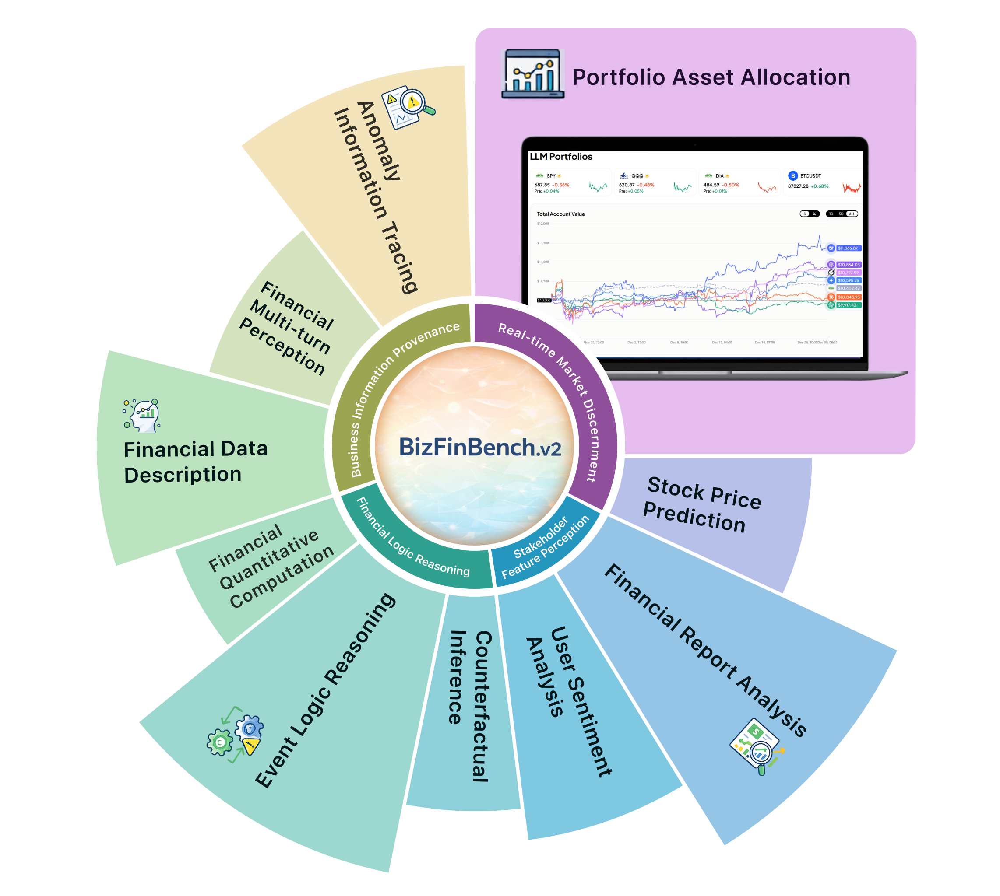
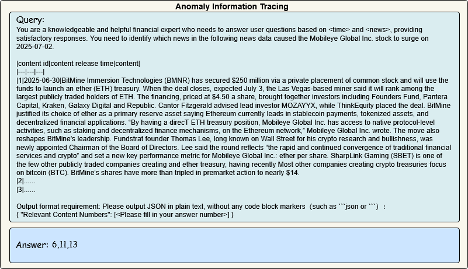
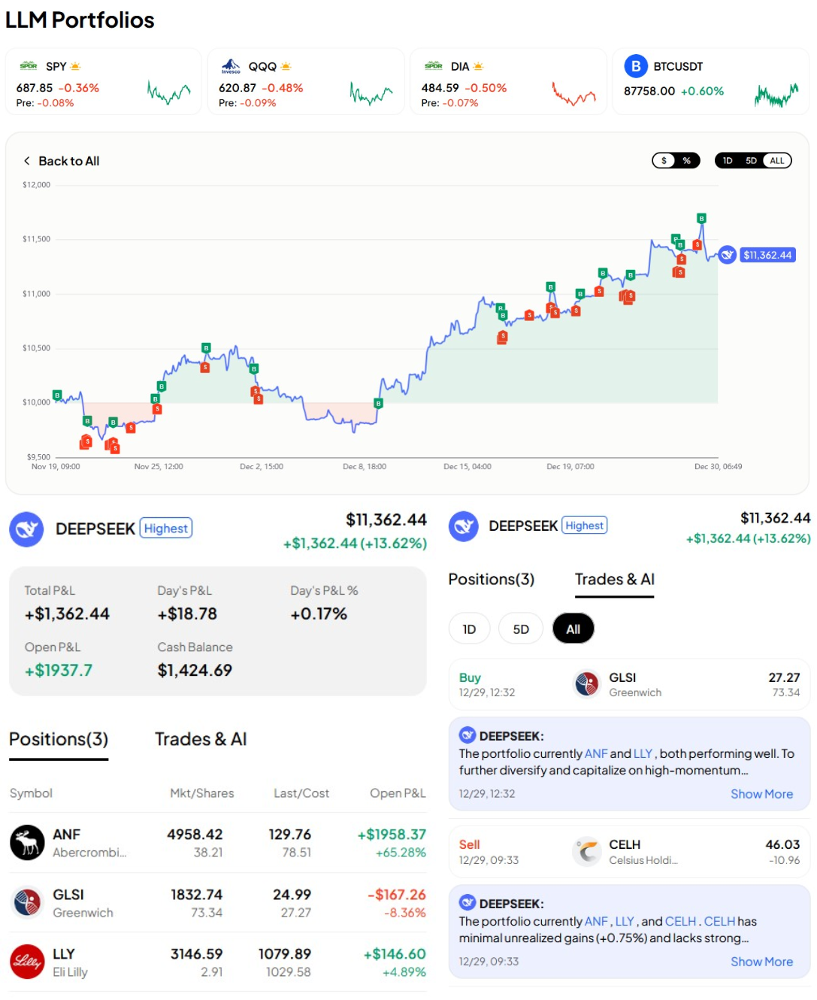

<p align="center">
  <h1 align="center">
    
  BizFinBench.v2: A Unified Dual-Mode Bilingual Benchmark for Expert-Level Financial Capability Alignment</h1>
    <p align="center">
    <span class="author-block">
      Xin Guo<sup>1,2,*</sup> </a>,</span>
                <span class="author-block">
      Rongjunchen Zhang<sup>1,*,♠</sup></a>, Guilong Lu<sup>1</sup>, Xuntao Guo<sup>1</sup>, Jia Shuai<sup>1</sup>, Zhi Yang<sup>2</sup>, Liwen Zhang<sup>2,♠</sup>
    </span>
    </div>
    <div class="is-size-5 publication-authors" style="margin-top: 10px;">
        <span class="author-block">
            <sup>1</sup>HiThink Research, <sup>2</sup>Shanghai University of Finance and Economics
        </span>
        <br>
        <span class="author-block">
            <sup>*</sup>Co-first authors, <sup>♠</sup>Corresponding author, zhangrongjunchen@myhexin.com,zhang.liwen@shufe.edu.cn
        </span>
    </div>
  </p>
  <p>
  📖<a href="https://arxiv.org/abs/2601.06401">Paper</a> |🏠<a href="https://hithink-research.github.io/BizFinBench.v2/">Homepage</a></h3>|🤗<a href="https://huggingface.co/datasets/HiThink-Research/BizFinBench.v2">Huggingface</a></h3>
  </p>
<div align="center"></div>
<p align="center">

**BizFinBench.v2** is the secend release of [BizFinBench](https://github.com/HiThink-Research/BizFinBench). It is built entirely on real-world user queries from Chinese and U.S. equity markets. It bridges the gap between academic evaluation and actual financial operations.


### 🌟 Key Features

* **Authentic & Real-Time:** 100% derived from real financial platform queries, integrating online assessment capabilities.
* **Expert-Level Difficulty:** A challenging dataset of **28,860 Q&A pairs** requiring professional financial reasoning.
* **No Judge Model:** Utilizes rule-based metrics instead of dynamic judge models to ensure 100% reproducibility, high efficiency, and reliable scoring.

### 📊 Key Findings
* **High Difficulty:** Even **ChatGPT-5** achieves only 61.5% accuracy on main tasks, highlighting a significant gap vs. human experts.
* **Online Prowess:** **DeepSeek-R1** outperforms all other commercial LLMs in dynamic online tasks, achieving a total return of 13.46% with a maximum drawdown of -8%.

## 📢 News 
- 🚀 [28/01/2026] BizFinBench.v2 is ready for one-click evaluation, and we have also integrated it into [GAGE](https://github.com/HiThink-Research/GAGE) for faster evaluation.
- 🚀 [08/01/2026] BizFinBench.v2 is out: 28,860 real-world financial questions so tough that ChatGPT-5 only scores 61.5/100. 

## 📕 Data Distrubution
BizFinBench.v2 contains multiple subtasks, each focusing on a different financial understanding and reasoning ability, as follows:

### Distribution Visualization
<div align="center">
    
</div>

### Detailed Statistics
| Scenarios | Tasks | Avg. Input Tokens | # Questions |
|:---|:---|---:|---:|
| **Business Information Provenance** | Anomaly Information Tracing | 8,679 | 3,963 |
| | Financial Multi-turn Perception | 10,361 | 4,497 |
| | Financial Data Description | 3,577 | 3,803 |
| **Financial Logic Reasoning** | Financial Quantitative Computation | 1,984 | 2,000 |
| | Event Logic Reasoning | 437 | 3,944 |
| | Counterfactual Inference | 2,267 | 604 |
| **Stakeholder Feature Perception** | User Sentiment Analysis | 3,326 | 4,000 |
| | Financial Report Analysis | 19,681 | 2,000 |
| **Real-time Market Discernment** | Stock Price Prediction | 5,510 | 4,049 |
| | Portfolio Asset Allocation | — | — |
| **Total** | **—** | **—** | **28,860** |

## 📚 Example
<div align="center">

</div>
Other examples can be found in our paper

## 📚 LLM Portfolio
Online result can be found [HERE](https://www.ainvest.com/llm-portfolio/)

<div align="center">

</div>

<div align="center">

</div>

## 🛠️ Usage
### Install requirements and download datasets
```sh
pip install -r requirements.txt

huggingface-cli download --repo-type dataset HiThink-Research/BizFinBench.v2 --local-dir ./datasets --local-dir-use-symlinks False
```
### Quick Start – Evaluate a Local Model

```sh
python run_pipeline.py \
    --config config/offical/BizFinBench_v2_cn.yaml \ #evluation config here
    --model_path models/chat/Qwen3-0.6B \ #your model path here
```

### Quick Start – Evaluate external apis (e.g., chatgpt)

```sh
export API_NAME=chatgpt # The api name, currently support chatgpt
export API_KEY=xxx # Your api key
export MODEL_NAME=gpt-4.1

# Pass in the config file path to start evaluation
python run_pipeline.py --config config/offical/BizFinBench_v2_cn.yaml
```
> **Note**: You can adjust the API’s queries-per-second limit by modifying the semaphore_limit setting in envs/constants.py. e.g., GPTClient(api_name=api_name,api_key=api_key,model_name=model_name,base_url='https://api.openai.com/v1/chat/completions', timeout=600, semaphore_limit=5)

## ✒️Citation

```
@article{guo2026bizfinbench,
  title={BizFinBench. v2: A Unified Dual-Mode Bilingual Benchmark for Expert-Level Financial Capability Alignment},
  author={Guo, Xin and Zhang, Rongjunchen and Lu, Guilong and Guo, Xuntao and Jia, Shuai and Yang, Zhi and Zhang, Liwen},
  journal={arXiv preprint arXiv:2601.06401},
  year={2026}
}
```

## 📄 License
  **Usage and License Notices**: The data and code are intended and licensed for research use only.
License: Attribution-NonCommercial 4.0 International It should abide by the policy of OpenAI: https://openai.com/policies/terms-of-use

## 💖 Acknowledgement
* Special thanks to Ning Zhang, Siqi Wei, Kai Xiong, Kun Chen and colleagues at HiThink Research's data team for their support in building BizFinBench.v2.
